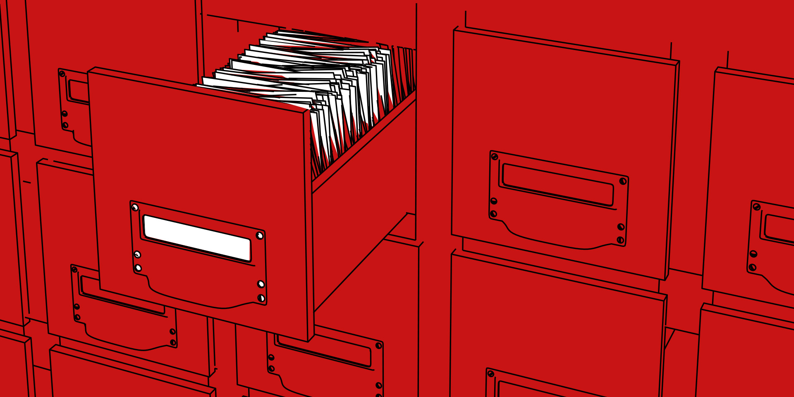

# Ein Core Curriculum für Studierende aller Fächer

Nicht nur durch die anhaltenden Krisen haben wir gelernt, wie ganz unterschiedliche Disziplinen in der Lage sein müssen, ihre Wissensbestände zu kontextualisieren und zu aktualisieren, um auf gesellschaftliche Nachfragen reagieren zu können. Und um das jeweils disziplinär gewachsene und geprägte Wissen auch proaktiv einbringen zu können.

## Geschichte und Gegenwart der Wissenschaften

Das Core Curriculum stellt diese Fragen für die Lehre und damit aus der Sicht von Studierenden, und grundsätzlich für alle Fächer. Es geht über Veranstaltungen hinaus, die seit langem und an vielen Orten zur Ausbildung von Methodenkompetenz, zum Verfassen von Hausarbeiten oder allgemeiner zur Einführung in wissenschaftliches Arbeiten angeboten werden. Das CC soll diese wichtigen Veranstaltungen nicht ersetzen, sondern einen größeren Rahmen bieten, in dem die genannten Angebote idealerweise noch eine größere Wirkung erzielen können. Um dieser Zielsetzung gerecht zu werden, besteht das CC aus zwei Teilen, die sich der Gegenwart und der Geschichte der Wissenschaften widmen und daher in der Tendenz jeweils soziologisch und historisch angelegt sind. Beide Module des CC sind zudem kultur- und medienwissenschaftlich angereichert.

## Flexibler Syllabus

Nicht nur das gesamte CC, sondern auch beide Teile sind modular gestaltet. Beide Veranstaltungen bestehen aus zentralen und fakultativen Elementen, um den Lehrenden in verschiedenen Fachkulturen die Möglichkeit zu geben, die Seminare jeweils an ihren Kontext vor Ort anzupassen: Im Maschinenbau wird man anders auswählen als in der Pädagogik oder der Politikwissenschaft; an einer Kunsthochschule anders als an einer Voll-Universität. Auch mit dem Material-Angebot des CC kann und soll kreativ umgegangen werden. Um die Vorbereitung zu erleichtern, werden Kern-Quellen vorgeschlagen, die jeweils flexibel zu ergänzen sind. Die Syllabi der zwei Module wurden mit dem Ziel entworfen, praktikable Angebote zu machen, die die Gestaltungsfreiheit der Lehrenden und Studierenden nicht zu stark einschränken.

## Co-Kreative Weiterentwicklung

Das CC wurde vom Rhine Ruhr Center for Science Communication Research in Zusammenarbeit mit Studierenden an exemplarisch ausgewählten Hochschulen entwickelt, und es wird idealerweise im Gebrauch vor Ort weiterentwickelt: Die Wissenschaften verändern sich weiter, und dieser Wandel muss im CC nicht nur abgebildet, sondern auch verhandelt werden. Insgesamt ist das CC einem „spirit“ praxeologischer Reflexion verpflichtet: Es soll Studierende und Lehrende gemeinsam dabei unterstützen, sich mit der Vielstimmigkeit und Komplexität von Wissenschaften und ihrer jeweiligen Geschichte zu beschäftigen.

## Gemeinsame Verantwortung für Wissenschaft im Studium

Dieses Ziel stellt aber keinen Selbstzweck dar. Wir gehen mit dem CC vielmehr davon aus, dass Studierende aller Fächer in Deutschland für eine Gesellschaft ausgebildet werden, in der zunehmend mehr Themen, Chancen und Konflikte verwissenschaftlicht sind. Von einer frühen, grundlegenden und konzeptionell vielschichtigen Befassung mit den Entstehungsgeschichten, aber auch den Entwicklungsmöglichkeiten aktuellen wissenschaftlichen Wissens können daher Studierende aller Fächer profitieren. Dies beginnt mit dem CC nicht erst nach dem Studium, sondern ermächtigt bereits in der Bachelor-Phase dazu, sich in der eigenen Studienumgebung, an der eigenen Hochschule zu fragen, warum die Dinge hier gerade so gemacht werden, wie sie gemacht werden – und ob man sich daran beteiligen könnte, gemeinsam noch etwas anders zu machen

> [!info] Title
> 
> Dieses Projekt wird als 'lebend' entwickelt. Der Quellcode ist öffentlich. Mehr Infos hier: [[imprint]]
